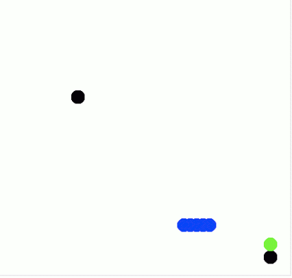
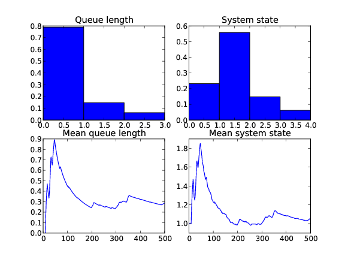
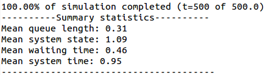
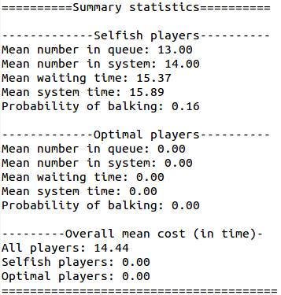
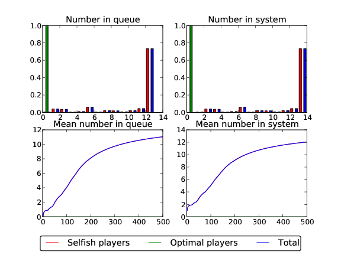
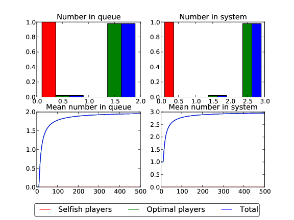
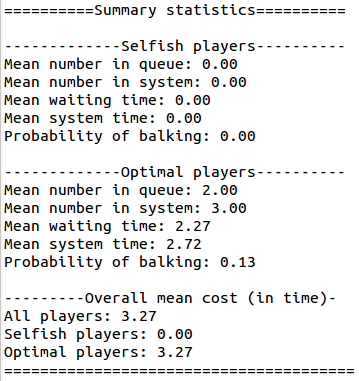
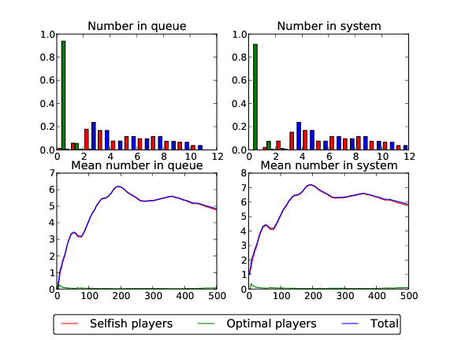
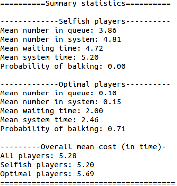
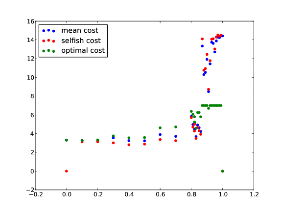

# Overview

This repo currently contains two things:

- A basic event driven MM1 queue simulation (that would be nice if someone turned in to an MMC queue). This was used in a screencast (link below).
- A more complicated clock based simulation of an MM1 queue that also allows for the investigation of selfish and social behaviours (currently this is all linked to Naor's 1969 paper). Importantly, this also contains a graphical element: allowing for the visualisation of the queue using the Turtle library.

## Basic event driven MM1 queue

This is some short code that can be used to simulate an *MM1* queue (a queue with Markovian inter-arrival and service rates and 1 server). The code is used in a short video [Simulating a Queue](http://www.youtube.com/watch?v=WEA8m3j-Jqk) describing a basic approach to simulating a queue.

If people would like to mess around with this code please do!

If people are interested in discrete event simulation within python I know that a library called [SimPy](http://simpy.sourceforge.net/) (unfortunate name re SymPy) exists but I've never used it.

## Graphical simulation

### Usage

The file `graphicalMM1.py` is both a library and an executable. It can thus be run directly:

~~~{.bash}
$ python graphicalMM1.py
~~~

This will run the simulation with some default values.

The file can be passed arguments. So help can be obtained by running:

~~~{.bash}
$ python graphicalMM1.py -h
~~~

Finally the file can be passed various arguments at the command line:

~~~{.bash}
$ python graphicalMM1.py -l 1 -m 2 -T 500 -w 200 -s True
~~~

This would run the simulation with an arrival rate of 1, a service rate of 2, for a total runtime of 500 time units, with a warm up period of 200 (for summary statistics) and the option to save summary graphs is set to True (as opposed to them being displayed by the matplotlib viewer). **I'd love for someone to improve the standard for passing command line arguments, I'm using argparse but would also like to be able to pass arguments in a given file format perhaps...**

### Graphical output

The main point of this script is that it creates a graphical representation of the queue (and customers going through the queue). This is useful when demonstrating certain concepts **but one of the little things I need to do is include an option to turn this off as it's slow**... Here's a gif showing the customers going through the queue:

### Plots

Once the simulation is finished a plot is created (which can be saved directly or displayed using the matplotlib viewer). This plot shows the average number of customers in the queue/system as well as the probability distribution of the queue/system:

Summary statistics are also printed:

### Selfish behaviour

In a 1969 paper entitled 'The Regulation of Queue Size by Levying Tolls' Naor looks selfish behaviour in a single server queue. To simplify the work of Naor, if we assume that service is 'worth' some quantity of time (`time is mney') beta then players (as opposed to customers) will join the queue if and only if their expected time in the system is less than beta. **Players who join the queue recieve a cost corresponding to their time through the system and players who don't joine recieve beta**.

The graphicalMM1 library allows for this to be taken in to account.

~~~{.bash}
$ python graphicalMM1.py -l 5 -m 2 -T 500 -w 200 -s True -p 1 -c 7
~~~

The `-p` flag is the proportion of selfish players and the `-c` flag the value of service (here set to 7). Here we see a plot of the results:

Summary statistics are also printed:

We see that despite players only joining when they expect to receive a cost less than 7 (passed to the executable with the `-c 7` option) the mean cost is 14.44. Note that the plot and summary statistics show results for 'optimal players'. What these are will become clear in the next section.

This mean cost can in fact be minimized and how to do this was the main result in Naor's paper.

### Optimal behaviour

There is a maximum length of the queue at which players should join that is given by Naor. The simulation also allows for this to be taken in to account.

~~~{.bash}
$ python graphicalMM1.py -l 5 -m 2 -T 500 -w 200 -s True -p 0 -c 7
~~~

Here is a plot of the results:

Summary statistics are also printed:

We see that the cost has indeed been reduced here (to 3.27).

### Mixed behaviour

Finally, the model allows us to see how the system behaves when we have a mixture of optimal and selfish players:

~~~{.bash}
$ python graphicalMM1.py -l 5 -m 2 -T 500 -w 200 -s True -p .85 -c 7
~~~

This would run with 85% of players acting selfishly.

Here is a plot of the results:

Summary statistics are also printed:

We see that almost all the optimal players were pushed out of the system by the selfish players. Also, the cost is here already quite reduced: 5.28.

Here is a plot of the mean cost as we increase the proportion of selfish players:

We see that for our parameters we only need a small number of optimal players to get quite a drastic reduction of costs.

**Note that none of the results here should be taken as anything more than a demonstration of what the simulation can do. A number of trials would need to be run to ensure that the effect of stochasticity is taken in to account and further more it does not look like the simulation is at steady state for the selfish example shown here.**

### Development

Currently on the to do list (in order of importance):

1. Include non graphical option
2. Speed up graphics
3. Include csv write (of results)
4. Generalise to multi server queue

# License Information
This work is licensed under a [Creative Commons Attribution-ShareAlike 3.0](http://creativecommons.org/licenses/by-sa/3.0/us/) license.  You are free to:

* Share: copy, distribute, and transmit the work,
* Remix: adapt the work

Under the following conditions:

* Attribution: You must attribute the work in the manner specified by the author or licensor (but not in any way that suggests that they endorse you or your use of the work).
* Share Alike: If you alter, transform, or build upon this work, you may distribute the resulting work only under the same or similar license to this one.

When attributing this work, please include me.
